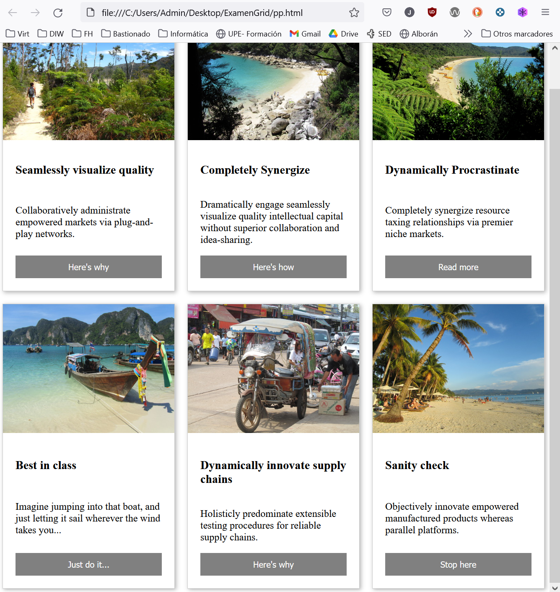

# Agencia de viajes HappyGoat

La agencia de viajes HappyGoat quiere que realicemos el diseño web de su página de inicio, donde se muestran iniciativas de viajes y un acceso para contratar dicho servicio.

El diseñador nos ha entregado el siguiente boceto y nos ha facilitado las imágenes que debemos usar. Si fuese posible deberemos realizar un diseño que se ajuste a pantallas móviles, tablets y PC.

El texto se debe ajustar a los diferentes tamaños de pantalla.

Cuándo visualicemos el contenido en móviles, la fotografía debe ocupar toda la tarjeta y aparecer el texto en el interior de color blanco y en negrita, al igual que el botón de "Ir a..."

La entrega deberá contener un fichero ZIP con los documentos HTML, CSS e imágenes WEB + captura de pantalla de los tres resultados. 